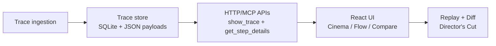

# Agent Director

```
   ___                    _       ____  _               _
  / _ \ _ __   ___  _ __ | |_    |  _ \(_)___  ___ ___ | |_ ___  _ __
 | | | | '_ \ / _ \| '_ \| __|   | | | | / __|/ __/ _ \| __/ _ \| '__|
 | |_| | | | | (_) | | | | |_    | |_| | \__ \ (_| (_) | || (_) | |
  \___/|_| |_|\___/|_| |_|\__|   |____/|_|___/\___\___/ \__\___/|_|
```

**Watch your agent think. Then direct it.**

Agent Director is a cinematic, chat-native trace debugger for AI agents. It turns agent runs into an interactive film strip and semantic graph, with replay + diff for “what-if” experimentation.

## Highlights
- Timestamp-accurate playback with overlap lanes (no summed-duration artifacts)
- Flow mode with Structure / Sequence / I/O binding layers + morph transitions
- Lazy-loaded step details with redaction-by-default and safe export enforcement
- Director’s Cut replay with deterministic invalidation + provenance
- Compare mode with stable alignment, ghost overlays, and diff export
- Insight Strip with critical path, concurrency heatmap, and IO/timing warnings
- CI + strict verification gates with mutation testing

## Quick demo (90 seconds)
1. Load the latest run and hit Play to show timeline playback.
2. Click a slow step to open the inspector and reveal redacted payloads.
3. Toggle Flow to morph into the graph, then enable I/O edges.
4. Replay from a tool step (Hybrid) and switch to Compare.
5. Export the diff summary and highlight the ghost overlay.

## Screenshots + Demo


## Concept art


## Architecture at a glance


## Why it feels different
- **Cinematic by default:** time is real, lanes are honest, and playback is smooth.
- **Graph is meaningful:** edges reflect structure, sequence, and I/O binding.
- **You can actually edit runs:** replay strategy is explicit and diffable.
- **Safe sharing:** redaction-by-default with explicit reveal and safe export.

## Quickstart

### Server (HTTP API for the UI)
```bash
python3 server/main.py
```

By default the server initializes a local data directory at `~/.agent-director` and bootstraps the demo trace if the store is empty. You can override the data directory:

```bash
AGENT_DIRECTOR_DATA_DIR=/path/to/store python3 server/main.py
```

### UI (React)
```bash
pnpm -C ui install
pnpm -C ui dev
```

The UI tries to load from `http://127.0.0.1:8787` by default. If the API is unavailable it will fall back to an embedded demo trace.

### MCP Server (optional)
If you're running inside an MCP host, you can start the MCP server entrypoint:

```bash
pip install "mcp[cli]"
python3 -m server.mcp_server
```

Set `AGENT_DIRECTOR_MCP_TRANSPORT` to `stdio` if your host requires stdio.
Set `AGENT_DIRECTOR_UI_URL` to the UI entrypoint that the host should load (defaults to `http://127.0.0.1:5173`).

## Testing

Run the full verification suite:

```bash
make verify
```

For stricter checks (includes mutation checks):

```bash
make verify-strict
```

For deep UX review (traces + Lighthouse + optional Percy):

```bash
make verify-ux
```

See `TESTING.md` for details.

## Docs (story + diagrams)
- `docs/index.md` — documentation hub
- `docs/story.md` — product narrative + positioning
- `docs/architecture.md` — system design + diagrams
- `docs/ux.md` — interaction model + magic moments
- `docs/brand.md` — logo + voice guidelines
- `docs/visual-system.md` — color, motion, and layout rules
- `docs/pitch-deck.pdf` — ready-to-present deck
- `docs/executive-summary.pdf` — one-page summary
- `docs/demo-script.md` — 90s live demo script

## Project hygiene
- `CONTRIBUTING.md` — dev flow + tests
- `SECURITY.md` — responsible disclosure

## Maintenance

Clean up old traces and export snapshots:

```bash
python3 scripts/store_maintenance.py cleanup --keep 20
python3 scripts/store_maintenance.py snapshot --output ./agent-director-snapshot.zip
```

---

If you want the logo swapped for a vector mark or full brand kit, say the word.
