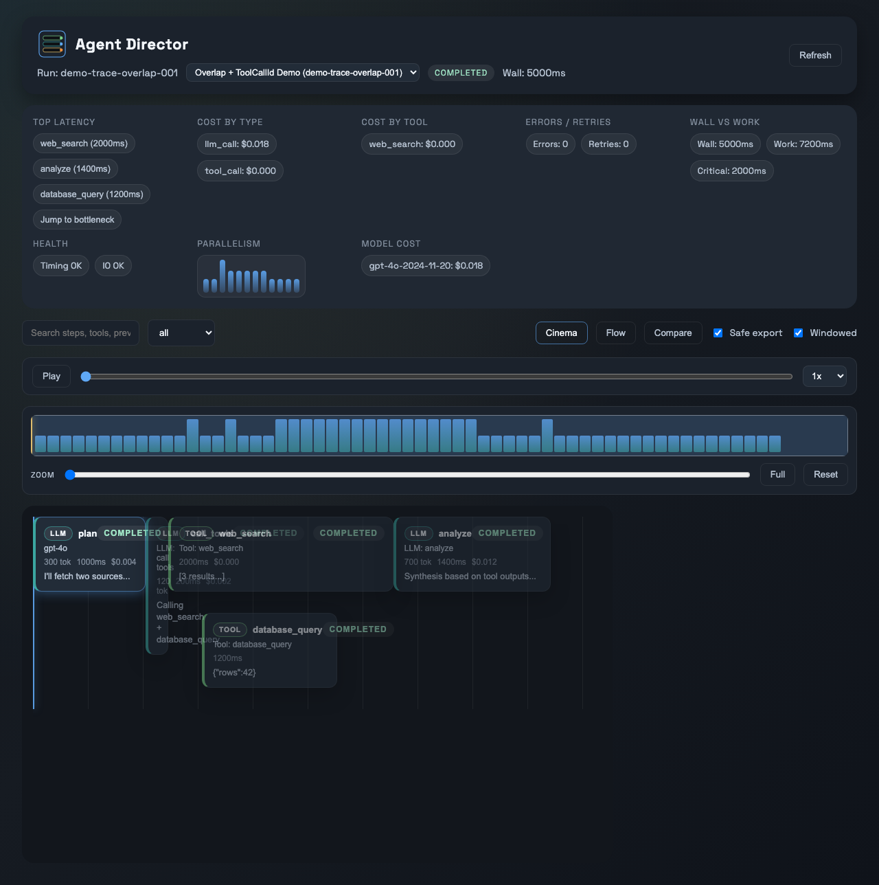
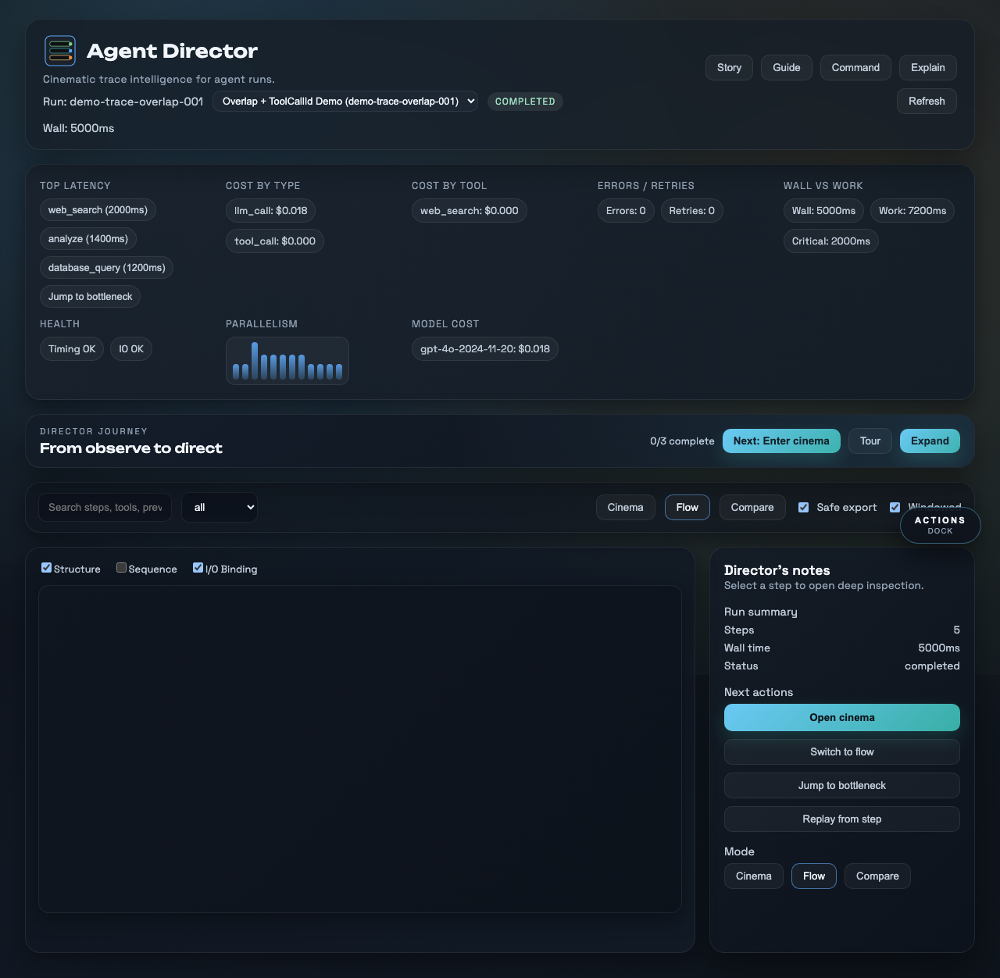
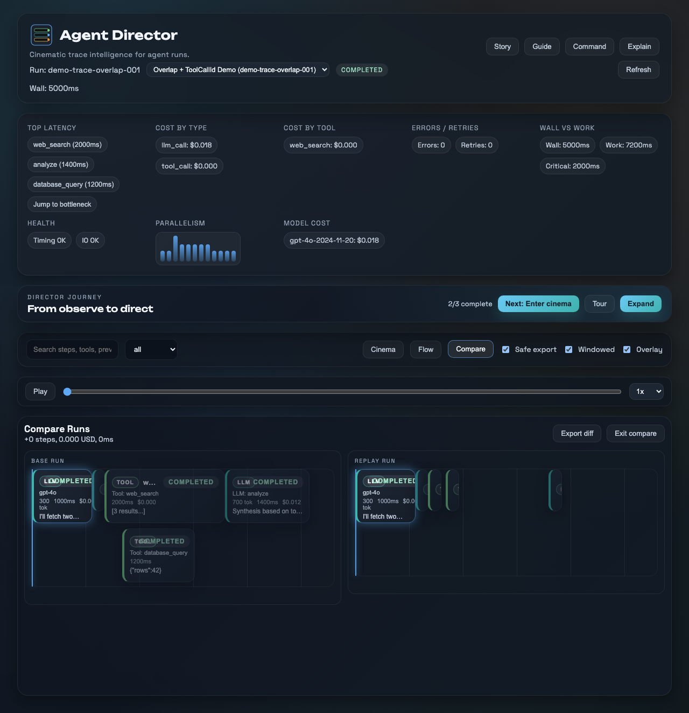
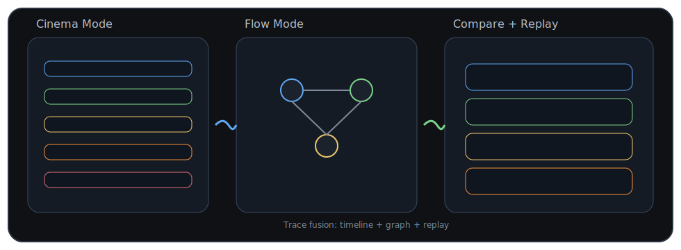
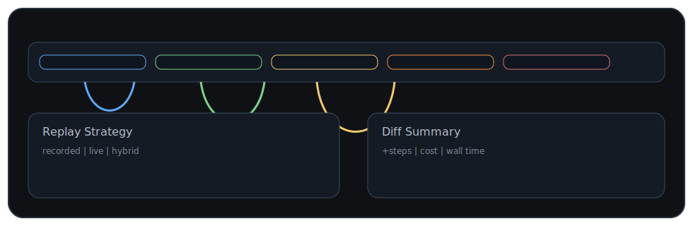
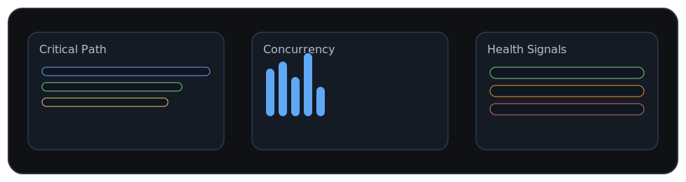
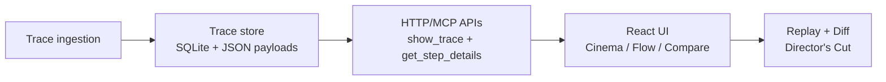

# Agent Director

```
    _    ____ _____ _   _ _____
   / \  / ___| ____| \ | |_   _|
  / _ \| |  _|  _| |  \| | | |
 / ___ \ |_| | |___| |\  | | |
/_/   \_\____|_____|_| \_| |_|

    ____  ___ ____  _____ ____ _____ ___  ____
   |  _ \|_ _|  _ \| ____/ ___|_   _/ _ \|  _ \
   | | | || || |_) |  _|| |     | || | | | |_) |
   | |_| || ||  _ <| |__| |___  | || |_| |  _ <
   |____/|___|_| \_\_____\____| |_| \___/|_| \_\
```

**Watch your agent think. Then direct it.**

Agent Director is a cinematic, chat-native trace debugger for AI agents. It turns agent runs into an interactive film strip and semantic graph, with replay + diff for “what-if” experimentation.

## Highlights
- Timestamp-accurate playback with overlap lanes (no summed-duration artifacts)
- Flow mode with Structure / Sequence / I/O binding layers + morph transitions
- Lazy-loaded step details with redaction-by-default and safe export enforcement
- Director’s Cut replay with deterministic invalidation + provenance
- Counterfactual replay matrix with causal ranking across scenarios
- Compare mode with stable alignment, ghost overlays, and diff export
- Matrix presets, scenario import/export, and redacted matrix exports
- Timeline studio bookmarks, clip ranges, and clip export artifacts
- Live session presence + share link for collaborative review sessions
- Adaptive onboarding persona lenses and theme modes (studio/focus/contrast)
- Insight Strip with critical path, concurrency heatmap, and IO/timing warnings
- Story Mode autopilot, quick actions dock, and command palette for instant demos
- Explain mode contextual overlays + guided tour for zero-guess onboarding
- Director briefing hero with the 3‑act flow and instant Tour / Story entry points
- CI + strict verification gates with mutation testing

## Quick demo (90 seconds)
1. Start the guided tour (from the intro overlay or Guide button), or hit Story mode to auto-run.
2. Pause at any point and take over manually.
3. Load the latest run and hit Play to show timeline playback.
4. Click a slow step to open the inspector and reveal redacted payloads.
5. Toggle Flow to morph into the graph, then enable I/O edges.
6. Replay from a tool step (Hybrid) and switch to Compare.
7. Switch to Matrix to run multiple replays and compare outcomes.
8. Export the diff summary and highlight the ghost overlay.

## Onboarding stack
- **Intro overlay** frames the three‑act journey (Observe → Inspect → Direct).
- **Director briefing** offers Tour, Story, and Explain entry points.
- **Guided tour** walks the interface end‑to‑end.
- **Explain mode** provides just‑in‑time help for every control.

## Screenshots + Demo





## Live demo
- Vercel (primary demo): https://agent-director.vercel.app
- GitHub Pages (static demo; requires public repo or Pro/Team/Enterprise for private): https://jlov7.github.io/agent-director/
- Codespaces (instant live preview; private-friendly): https://github.com/codespaces/new?hide_repo_select=true&repo=jlov7/agent-director

## Concept art




## Architecture at a glance


## Why it feels different
- **Cinematic by default:** time is real, lanes are honest, and playback is smooth.
- **Graph is meaningful:** edges reflect structure, sequence, and I/O binding.
- **You can actually edit runs:** replay strategy is explicit and diffable.
- **Safe sharing:** redaction-by-default with explicit reveal and safe export.
- **Scenario governance:** presets, validation, and redacted exports for matrix runs.

## Quickstart

### Server (HTTP API for the UI)
```bash
python3 server/main.py
```

By default the server initializes a local data directory at `~/.agent-director` and bootstraps the demo trace if the store is empty. You can override the data directory:

```bash
AGENT_DIRECTOR_DATA_DIR=/path/to/store python3 server/main.py
```

### UI (React)
```bash
pnpm -C ui install
pnpm -C ui dev
```

The UI tries to load from `http://127.0.0.1:8787` by default. If the API is unavailable it will fall back to an embedded demo trace.

### MCP Server (optional)
If you're running inside an MCP host, you can start the MCP server entrypoint:

```bash
pip install "mcp[cli]"
python3 -m server.mcp_server
```

Set `AGENT_DIRECTOR_MCP_TRANSPORT` to `stdio` if your host requires stdio.
Set `AGENT_DIRECTOR_UI_URL` to the UI entrypoint that the host should load (defaults to `http://127.0.0.1:5173`).

## Environment variables

### Server

| Variable | Default | Purpose |
|----------|---------|---------|
| `AGENT_DIRECTOR_DATA_DIR` | `~/.agent-director` | Overrides trace/data storage path. |
| `AGENT_DIRECTOR_SAFE_EXPORT` | `0` | Forces redaction-safe exports on all step detail responses. |
| `AGENT_DIRECTOR_MCP_TRANSPORT` | host default | MCP transport (`stdio` when required by host). |
| `AGENT_DIRECTOR_UI_URL` | `http://127.0.0.1:5173` | UI URL surfaced by MCP resource metadata. |

### UI

| Variable | Default | Purpose |
|----------|---------|---------|
| `VITE_API_BASE` | `http://127.0.0.1:8787` | Base URL for server API calls. |
| `VITE_FORCE_DEMO` | `0` | Forces embedded demo trace mode (useful for deterministic demos/tests). |
| `VITE_SKIP_INTRO` | `0` | Skips intro overlay for controlled environments. |
| `VITE_HIDE_BUILD_DATE` | `0` | Hides build timestamp in the header. |
| `BASE_PATH` | `/` | Build-time base path for static hosting (for example GitHub Pages). |

## Troubleshooting
- **UI shows demo data when you expect real traces.** Ensure the API is running at `http://127.0.0.1:8787` or set `VITE_API_BASE` to your API URL. Confirm `VITE_FORCE_DEMO` is not set to `1` for the UI build.
- **UI cannot reach the API.** Verify the server is running and port `8787` is free. If hosting the API elsewhere, set `VITE_API_BASE` and rebuild the UI.
- **Replay or step details return errors.** Confirm traces exist in `AGENT_DIRECTOR_DATA_DIR` and the directory is writable. If safe export is required, set `AGENT_DIRECTOR_SAFE_EXPORT=1` and restart the server.
- **Matrix run stays in running state.** Validate the anchor step exists in the trace and scenarios count is ≤ 25. Cancel and rerun after trimming scenarios.
- **Matrix run fails immediately.** Check for invalid scenario JSON or duplicate scenario names, then rerun.
- **Matrix export looks redacted.** Disable Safe export in the toolbar if you need raw values (only when sharing is not required).
- **MCP host opens a blank UI.** Set `AGENT_DIRECTOR_UI_URL` to the UI address the host can reach. If the host requires stdio, set `AGENT_DIRECTOR_MCP_TRANSPORT=stdio`.
## Testing

Run the full verification suite:

```bash
make verify
```

For stricter checks (includes mutation checks):

```bash
make verify-strict
```

For release-gate evidence (writes `artifacts/doctor.json`):

```bash
make doctor
```

For full 10/10 system scorecards (writes `artifacts/scorecards.json`):

```bash
make scorecard
```

For deep UX review (traces + Lighthouse + optional Percy):

```bash
make verify-ux
```

### Test Coverage

| Category | Tests | Coverage |
|----------|-------|----------|
| Unit (Vitest) | 239 | Components, hooks, API, utilities |
| E2E (Playwright) | 43 | Onboarding, keyboard, inspector, flow, matrix |
| Visual | 7+ | Cinema, Flow, Compare, Matrix state snapshots |
| Accessibility | 1 | Axe violations scan |

See `TESTING.md` for details.

## Docs (story + diagrams)
- `docs/index.md` — documentation hub
- `docs/story.md` — product narrative + positioning
- `docs/architecture.md` — system design + diagrams
- `docs/ux.md` — interaction model + magic moments
- `docs/hosting.md` — live demo hosting options
- `docs/brand.md` — logo + voice guidelines
- `docs/visual-system.md` — color, motion, and layout rules
- `docs/pitch-deck.pdf` — ready-to-present deck
- `docs/executive-summary.pdf` — one-page summary
- `docs/demo-script.md` — 90s live demo script

## Gameplay Systems (v2)

The Gameplay Command Center now supports backend-authoritative multiplayer and progression systems:

- Realtime co-op gameplay sessions (`/api/gameplay/sessions` + `/api/stream/gameplay/{session_id}`)
- Conflict-safe synchronized actions with optimistic version checks
- Persistent player skill/loadout profiles
- Roguelike campaign runs and branching narrative outcomes
- Asymmetric PvP loop, timeline fork/rewind/merge, and boss phases
- Guild operations (roster, events, scoreboards)
- Seasonal liveops rotation with telemetry-backed difficulty factor

Quick API smoke examples:

```bash
curl -X POST http://127.0.0.1:8787/api/gameplay/sessions \
  -H 'Content-Type: application/json' \
  -d '{"trace_id":"trace-1","host_player_id":"jason","name":"Night Ops"}'

curl http://127.0.0.1:8787/api/gameplay/liveops/current
```

## Project hygiene
- `CONTRIBUTING.md` — dev flow + tests
- `SECURITY.md` — responsible disclosure

## Maintenance

Clean up old traces and export snapshots:

```bash
python3 scripts/store_maintenance.py cleanup --keep 20
python3 scripts/store_maintenance.py snapshot --output ./agent-director-snapshot.zip
```

## Deployment notes

### Vercel
- The repository includes `vercel.json` with explicit install/build/output settings for `ui`.
- Required Vercel env vars for deterministic public demo: `VITE_FORCE_DEMO=1`, `VITE_HIDE_BUILD_DATE=1`.
- Recommended deploy flow:
  - `vercel deploy -y` (preview)
  - `vercel deploy --prod -y` (production)
  - `vercel inspect agent-director.vercel.app --logs` (post-deploy verification)
- See `docs/hosting.md` for full hosting runbook.

### GitHub Pages
- The `deploy-pages` workflow builds `ui` with `BASE_PATH=/<repo>/` and publishes `ui/dist`.
- Push to `main` to trigger deployment.

---

If you want the logo swapped for a vector mark or full brand kit, say the word.

<sub>Agent Director is a personal R&D / passion project by Jason Lovell. It is independent work and is not sponsored by, endorsed by, or affiliated with Jason’s employer.</sub>
