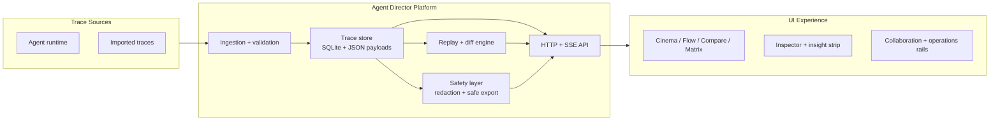
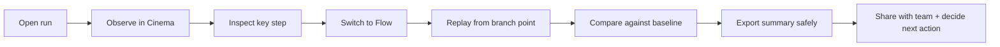

# Agent Director

```
    _    ____ _____ _   _ _____
   / \  / ___| ____| \ | |_   _|
  / _ \| |  _|  _| |  \| | | |
 / ___ \ |_| | |___| |\  | | |
/_/   \_\____|_____|_| \_| |_|

    ____  ___ ____  _____ ____ _____ ___  ____
   |  _ \|_ _|  _ \| ____/ ___|_   _/ _ \|  _ \
   | | | || || |_) |  _|| |     | || | | | |_) |
   | |_| || ||  _ <| |__| |___  | || |_| |  _ <
   |____/|___|_| \_\_____\____| |_| \___/|_| \_\
```

**Watch your agent think. Then direct it.**

Agent Director is a cinematic, chat-native debugger for AI-agent runs. It turns traces into an interactive timeline + graph, then lets teams replay, compare, and safely share what changed.

## Choose Your Path

| I am... | Start here | Outcome |
|---|---|---|
| New and non-technical | [`docs/non-technical-guide.md`](docs/non-technical-guide.md) | Understand value, workflows, and demo story in plain language |
| Engineer / architect | [`docs/technical-guide.md`](docs/technical-guide.md) | Understand architecture, contracts, and extension points |
| Demo host | [`docs/demo-script.md`](docs/demo-script.md) | Run a polished 90-second walkthrough |
| Contributor | [`CONTRIBUTING.md`](CONTRIBUTING.md) | Set up, test, and contribute safely |
| Release owner | [`docs/index.md`](docs/index.md) | Navigate operational, legal, and launch docs |

## Product In 30 Seconds

- **Observe:** Play a truthful wall-clock timeline with overlap lanes.
- **Inspect:** Open redacted step details, view causal overlays, and inspect structure.
- **Direct:** Replay from any point, compare outcomes, and export safe artifacts.

Key capabilities:
- Cinema, Flow, Compare, and Matrix analysis modes.
- Director's Cut replay with deterministic invalidation + diff.
- Scenario workbench and matrix outcomes with causal ranking.
- Story mode, guided tour, explain overlays, and setup wizard.
- Collaboration rails: ownership, handoff digests, support diagnostics, export queue.
- Safety by default: redaction-first with safe-export guardrails.

## Visual Tour


### Concept illustrations


## Architecture At A Glance



## User Journey At A Glance



See full journey maps in [`docs/user-journeys.md`](docs/user-journeys.md).

## Quickstart (5 Minutes)

### Prerequisites

- Python `3.12+`
- Node.js `20+`
- `pnpm`

### 1) Install

```bash
pnpm -C ui install
```

### 2) Start API

```bash
python3 server/main.py
```

Default API URL: `http://127.0.0.1:8787`

### 3) Start UI

```bash
pnpm -C ui dev
```

Default UI URL: `http://127.0.0.1:5173`

### 4) Verify quality gates

```bash
make verify
make doctor
make scorecard
```

### 5) Optional MCP mode

```bash
pip install "mcp[cli]"
python3 -m server.mcp_server
```

Useful env vars:
- `AGENT_DIRECTOR_MCP_TRANSPORT=stdio`
- `AGENT_DIRECTOR_UI_URL=http://127.0.0.1:5173`

## Environment variables

### Server

| Variable | Default | Purpose |
|---|---|---|
| `AGENT_DIRECTOR_DATA_DIR` | `~/.agent-director` | Overrides trace/data storage path. |
| `AGENT_DIRECTOR_SAFE_EXPORT` | `0` | Forces redaction-safe exports on step detail responses. |
| `AGENT_DIRECTOR_MCP_TRANSPORT` | host default | MCP transport (`stdio` when required by host). |
| `AGENT_DIRECTOR_UI_URL` | `http://127.0.0.1:5173` | UI URL surfaced by MCP metadata. |

### UI

| Variable | Default | Purpose |
|---|---|---|
| `VITE_API_BASE` | `http://127.0.0.1:8787` | Base URL for server API calls. |
| `VITE_FORCE_DEMO` | `0` | Forces embedded demo trace mode. |
| `VITE_SKIP_INTRO` | `0` | Skips intro overlay for controlled demos/tests. |
| `VITE_HIDE_BUILD_DATE` | `0` | Hides build timestamp in header. |
| `BASE_PATH` | `/` | Build-time base path for static hosting. |

## Live Demo

- Vercel: [agent-director.vercel.app](https://agent-director.vercel.app)
- GitHub Pages: [jlov7.github.io/agent-director](https://jlov7.github.io/agent-director/)
- Codespaces launch link: [Open in Codespaces](https://github.com/codespaces/new?hide_repo_select=true&repo=jlov7/agent-director)

## API Snapshot

Base URL (default): `http://127.0.0.1:8787`

Common endpoints:
- `GET /api/health`
- `GET /api/traces?latest=1`
- `POST /api/traces/{trace_id}/replay`
- `POST /api/compare`
- `POST /api/replay-jobs`
- `GET /api/stream/traces/latest` (SSE)

Full reference: [`docs/api-reference.md`](docs/api-reference.md)

## Testing

- Standard suite: `make verify`
- Strict suite: `make verify-strict`
- UX suite: `make verify-ux`
- Release evidence: `make doctor`
- Scorecards: `make scorecard`

## Documentation Hub

- Core index: [`docs/index.md`](docs/index.md)
- Non-technical guide: [`docs/non-technical-guide.md`](docs/non-technical-guide.md)
- Technical guide: [`docs/technical-guide.md`](docs/technical-guide.md)
- User journeys: [`docs/user-journeys.md`](docs/user-journeys.md)
- Getting started: [`docs/getting-started.md`](docs/getting-started.md)
- Architecture: [`docs/architecture.md`](docs/architecture.md)
- UX model: [`docs/ux.md`](docs/ux.md)
- Story + narrative: [`docs/story.md`](docs/story.md)
- Visual system: [`docs/visual-system.md`](docs/visual-system.md)
- Hosting and deployment: [`docs/hosting.md`](docs/hosting.md)
- Operations runbooks: [`docs/ops/`](docs/ops)
- Legal docs: [`docs/legal/`](docs/legal)

## Deployment notes

### Vercel

- Config file: [`vercel.json`](vercel.json)
- Toolchain pinning: root [`package.json`](package.json) (`pnpm@10.29.3`)
- Recommended environment variables for deterministic public demo:
  - `VITE_FORCE_DEMO=1`
  - `VITE_HIDE_BUILD_DATE=1`

Recommended commands:

```bash
vercel deploy -y
vercel deploy --prod -y
vercel inspect agent-director.vercel.app --logs
make vercel-check
```

## Repository Quality Standards

- Verification suite: `make verify`
- Strict verification: `make verify-strict`
- UX verification: `make verify-ux`
- Release evidence: `make doctor`
- Quality scorecards: `make scorecard`

Security and contribution docs:
- [`SECURITY.md`](SECURITY.md)
- [`CONTRIBUTING.md`](CONTRIBUTING.md)

## License

Licensed under [`LICENSE`](LICENSE).

---

<sub>Agent Director is a personal R&D / passion project by Jason Lovell. It is independent work and is not sponsored by, endorsed by, or affiliated with Jason's employer.</sub>
