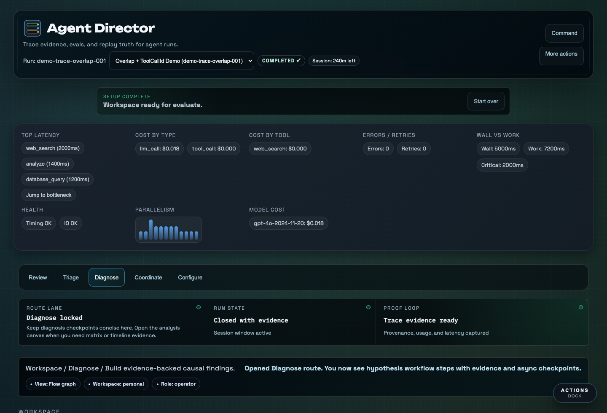
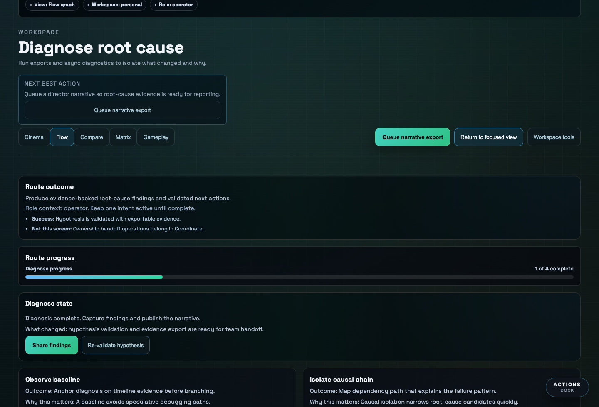
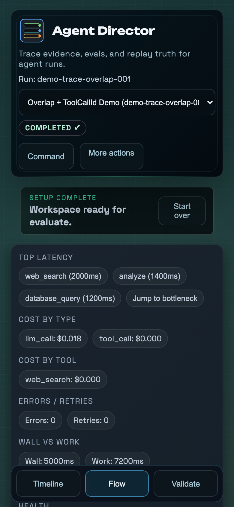
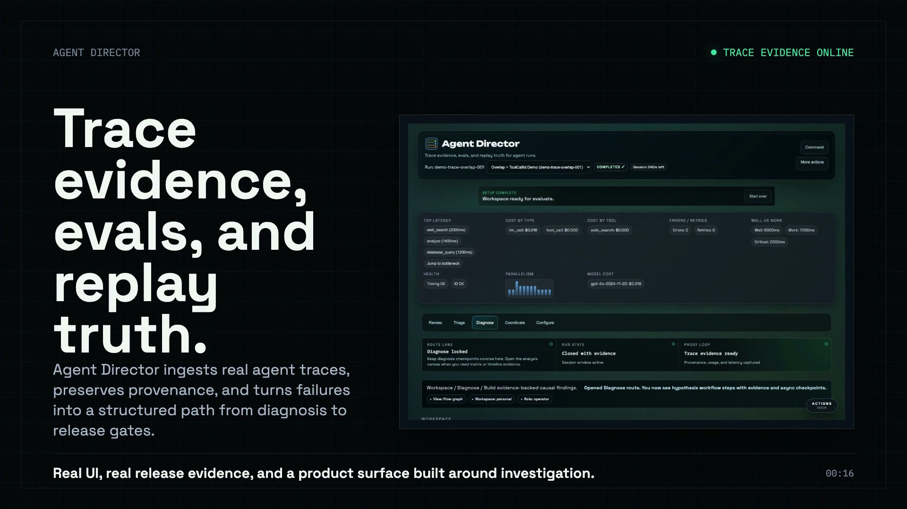
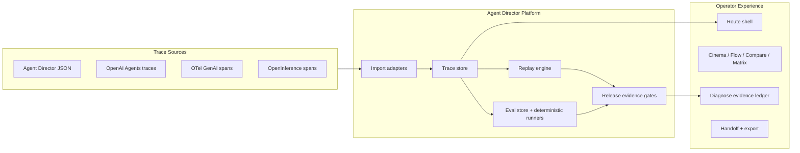

# Agent Director

[](https://github.com/jlov7/agent-director/actions/workflows/verify.yml)
[](https://github.com/jlov7/agent-director/actions/workflows/visual-verify.yml)
[](https://github.com/jlov7/agent-director/actions/workflows/ux-review.yml)

**Trace evidence, evals, and replay truth for AI-agent runs.**

Agent Director is a local-first observability and improvement loop for agent builders. It ingests traces, preserves provenance, explains failures, turns interesting runs into deterministic eval cases, and keeps replay semantics honest.



## Why It Exists

Agent teams do not need another pretty trace viewer. They need a way to answer:

- What happened in this run?
- Which step created the failure or cost spike?
- Can we turn this trace into repeatable release evidence?
- Is this replay recorded, simulated, or actually executed?
- Are the current release gates proving the right product truth?

Agent Director is built around those questions. The interface is a command-grade investigation surface, not a marketing dashboard.

## Current Release Proof

The branch is release-gated by executable evidence, not a checklist.

| Proof | Command | Current bar |
|---|---|---|
| Full release gates | `make doctor` | `G1` through `G10` must pass |
| Scorecards | `make scorecard` | `90/90`, all domains `10/10` |
| Real trace dogfood | `make dogfood-evidence` | 8 fixtures across 4 source formats |
| Product coherence | `make system-coherence` | active docs, gates, and product thesis must agree |
| Frontend visual QA | `make verify-frontend` | unit, E2E, visual, matrix, Lighthouse |

Latest gate model:

- `G1-core-journeys`
- `G2-onboarding-help`
- `G3-quality`
- `G4-accessibility`
- `G5-performance`
- `G6-security`
- `G7-docs`
- `G8-ci`
- `G9-frontier-evidence`
- `G10-system-coherence`

## Product Surface

| Diagnose evidence | Trace-to-eval workflow | Mobile route shell |
|---|---|---|
|  |  |  |

## Overview Film

[](docs/videos/agent-director-overview/renders/agent-director-overview.mp4)

The 80-second HyperFrames proof film explains the problem, the trace-to-eval workflow, replay truth, and release evidence in one pass. Source, design notes, and render commands live in [`docs/videos/agent-director-overview/`](docs/videos/agent-director-overview/).

## Core Workflows

### 1. Import Real Traces

`POST /api/traces/import` accepts:

- Agent Director JSON
- OpenAI Agents-style traces
- OpenTelemetry GenAI spans
- OpenInference spans

Imports normalize into `TraceSummary` and `StepDetails` with provider trace IDs, span IDs, parent span IDs, framework/source metadata, token usage, cost details, and importer warnings.

### 2. Investigate With Evidence

Operators move through focused routes:

- `Review`: understand run health and top risk.
- `Triage`: isolate the urgent failure.
- `Diagnose`: build evidence-backed causal findings.
- `Coordinate`: assign owners and hand off context.
- `Configure`: keep workspace and release defaults safe.

### 3. Convert Traces Into Evals

Failed or interesting traces can become deterministic eval cases:

- `POST /api/eval-cases/from-trace`
- `GET /api/eval-cases`
- `POST /api/eval-runs`
- `GET /api/eval-runs/{id}`

The local evaluator is intentionally deterministic so release evidence does not depend on external LLM availability.

### 4. Keep Replay Truthful

Replay output distinguishes:

- `recorded_replay`: copied from recorded evidence.
- `counterfactual_simulation`: deterministic branch analysis, not live execution.
- `executed_replay`: reserved for future live agent re-execution.

The UI and API expose `executionMode` and `truthLabel` so simulated replay is never presented as actual re-execution.

## Architecture At A Glance


```mermaid
flowchart LR
  subgraph Sources["Trace Sources"]
    A1["Agent Director JSON"]
    A2["OpenAI Agents traces"]
    A3["OTel GenAI spans"]
    A4["OpenInference spans"]
  end

  subgraph Platform["Agent Director Platform"]
    B1["Import adapters"]
    B2["Trace store"]
    B3["Replay engine"]
    B4["Eval store + deterministic runners"]
    B5["Release evidence gates"]
  end

  subgraph Experience["Operator Experience"]
    C1["Route shell"]
    C2["Cinema / Flow / Compare / Matrix"]
    C3["Diagnose evidence ledger"]
    C4["Handoff + export"]
  end

  Sources --> B1 --> B2
  B2 --> B3
  B2 --> B4
  B3 --> B5
  B4 --> B5
  B2 --> C1
  B5 --> C3
```

## Quickstart

### Prerequisites

- Python `3.12+`
- Node.js `20+`
- `pnpm`

### 1. Install UI Dependencies

```bash
pnpm -C ui install
```

### 2. Start The API

```bash
python3 server/main.py
```

Default API URL: `http://127.0.0.1:8787`

### 3. Start The UI

```bash
pnpm -C ui dev
```

Default UI URL: `http://127.0.0.1:5173`

### 4. Verify The Repo

```bash
make verify
make doctor
make scorecard
```

### 5. Optional MCP Mode

```bash
pip install "mcp[cli]"
python3 -m server.mcp_server
```

Useful env vars:

- `AGENT_DIRECTOR_MCP_TRANSPORT=stdio`
- `AGENT_DIRECTOR_UI_URL=http://127.0.0.1:5173`

## Environment variables

### Server

| Variable | Default | Purpose |
|---|---|---|
| `AGENT_DIRECTOR_DATA_DIR` | `~/.agent-director` | Overrides trace/data storage path. |
| `AGENT_DIRECTOR_PORT` | `8787` | Overrides the HTTP API port for isolated runs and tests. |
| `AGENT_DIRECTOR_SAFE_EXPORT` | `0` | Forces redaction-safe exports on step detail responses. |
| `AGENT_DIRECTOR_MCP_TRANSPORT` | host default | MCP transport, usually `stdio` when required by host. |
| `AGENT_DIRECTOR_UI_URL` | `http://127.0.0.1:5173` | UI URL surfaced by MCP metadata. |
| `AGENT_DIRECTOR_ENABLE_GAMEPLAY` | `0` | Enables private experimental gameplay APIs. Disabled by default. |

### UI

| Variable | Default | Purpose |
|---|---|---|
| `VITE_API_BASE` | `http://127.0.0.1:8787` | Base URL for server API calls. |
| `VITE_FORCE_DEMO` | `0` | Forces embedded demo trace mode. |
| `VITE_SKIP_INTRO` | `0` | Skips intro overlay for controlled demos/tests. |
| `VITE_HIDE_BUILD_DATE` | `0` | Hides build timestamp in header. |
| `BASE_PATH` | `/` | Build-time base path for static hosting. |

## API Snapshot

Base URL: `http://127.0.0.1:8787`

Common endpoints:

- `GET /api/health`
- `GET /api/traces?latest=1`
- `POST /api/traces/import`
- `POST /api/eval-cases/from-trace`
- `GET /api/eval-cases`
- `POST /api/eval-runs`
- `GET /api/eval-runs/{id}`
- `POST /api/traces/{trace_id}/replay`
- `POST /api/compare`
- `POST /api/replay-jobs`
- `GET /api/stream/traces/latest`

Full reference: [`docs/api-reference.md`](docs/api-reference.md)

## Testing

| Goal | Command |
|---|---|
| Standard verification | `make verify` |
| Strict verification | `make verify-strict` |
| UX verification | `make verify-ux` |
| Frontend full gate | `make verify-frontend` |
| Deterministic visual verification | `make verify-visual` |
| Real trace dogfood evidence | `make dogfood-evidence` |
| Product/release coherence | `make system-coherence` |
| Release doctor | `make doctor` |
| Scorecards | `make scorecard` |
| Executable demo docs | `make demo-proof-verify` |

## Repository Map

```text
.
├── server/                  # Python API, trace import, replay, evals, MCP, backend tests
├── ui/                      # React + TypeScript app, route shell, E2E/unit/visual tests
├── docs/                    # Product docs, audits, screenshots, runbooks, demos
│   ├── audits/              # Frontier and system-coherence audits
│   ├── demos/               # Executable Showboat proof docs
│   ├── ops/                 # Release, support, observability, and safety runbooks
│   └── screenshots/         # README and QA screenshots
├── scripts/                 # Verification, doctor, scorecard, release, visual tooling
├── artifacts/               # Generated evidence from local gates
├── .github/workflows/       # CI, UX, visual, performance, deploy, demo proof
├── BURNDOWN.md              # Current audit burndown
├── RELEASE_GATES.md         # Gate definitions and evidence requirements
├── SCORECARDS.md            # 10/10 domain score model
└── README.md                # Repo front door
```

## Documentation Hub

Start here by role:

| Reader | Entry point |
|---|---|
| Product evaluator | [`docs/non-technical-guide.md`](docs/non-technical-guide.md) |
| Engineer or architect | [`docs/technical-guide.md`](docs/technical-guide.md) |
| Operator | [`docs/quickstart-operator-5-minutes.md`](docs/quickstart-operator-5-minutes.md) |
| Executive/evaluator | [`docs/quickstart-evaluator-5-minutes.md`](docs/quickstart-evaluator-5-minutes.md) |
| Demo host | [`docs/demo-script.md`](docs/demo-script.md) |
| Release owner | [`docs/index.md`](docs/index.md) |

Key evidence docs:

- [`BURNDOWN.md`](BURNDOWN.md)
- [`RELEASE_GATES.md`](RELEASE_GATES.md)
- [`SCORECARDS.md`](SCORECARDS.md)
- [`docs/audits/2026-05-frontier-audit.md`](docs/audits/2026-05-frontier-audit.md)
- [`docs/audits/2026-05-carpathy-system-audit.md`](docs/audits/2026-05-carpathy-system-audit.md)
- [`docs/visual-verification-protocol.md`](docs/visual-verification-protocol.md)

## Live Demo

- Vercel: [agent-director.vercel.app](https://agent-director.vercel.app)
- GitHub Pages: [jlov7.github.io/agent-director](https://jlov7.github.io/agent-director/)
- Codespaces: [Open in Codespaces](https://github.com/codespaces/new?hide_repo_select=true&repo=jlov7/agent-director)

## Deployment notes

### Vercel

- Config file: [`vercel.json`](vercel.json)
- Toolchain pinning: root [`package.json`](package.json), `pnpm@10.29.3`

Recommended deterministic public demo env:

```bash
VITE_FORCE_DEMO=1
VITE_HIDE_BUILD_DATE=1
```

Recommended commands:

```bash
vercel deploy -y
vercel deploy --prod -y
vercel inspect agent-director.vercel.app --logs
make vercel-check
```

### GitHub Pages

The Pages workflow builds the static UI with:

```bash
BASE_PATH=/${GITHUB_REPOSITORY##*/}/
VITE_FORCE_DEMO=1
VITE_HIDE_BUILD_DATE=1
pnpm -C ui build
```

## Contribution Standard

Before opening a PR:

1. Run the narrow checks for the files you touched.
2. Run `make doctor` before release-significant changes.
3. Run visual verification for visual-critical UI changes.
4. Keep `GAPS.md`, `RELEASE_GATES.md`, and `.codex/PLANS.md` current when the release story changes.

Security and contribution docs:

- [`SECURITY.md`](SECURITY.md)
- [`CONTRIBUTING.md`](CONTRIBUTING.md)
- [`TESTING.md`](TESTING.md)

## Disclaimer

This is a personal project built independently. It is not affiliated with, endorsed by, or representative of any employer or client work.

## License

Licensed under [`LICENSE`](LICENSE).

---

<sub>Agent Director is a personal R&D / passion project by Jason Lovell. It is independent work and is not sponsored by, endorsed by, or affiliated with Jason's employer.</sub>
