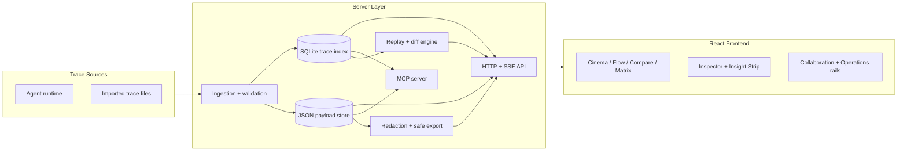
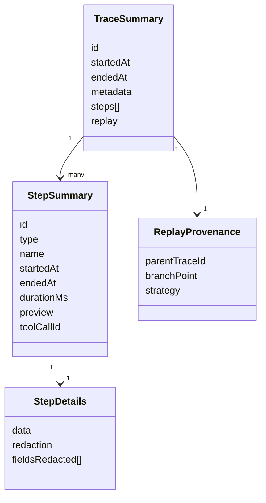
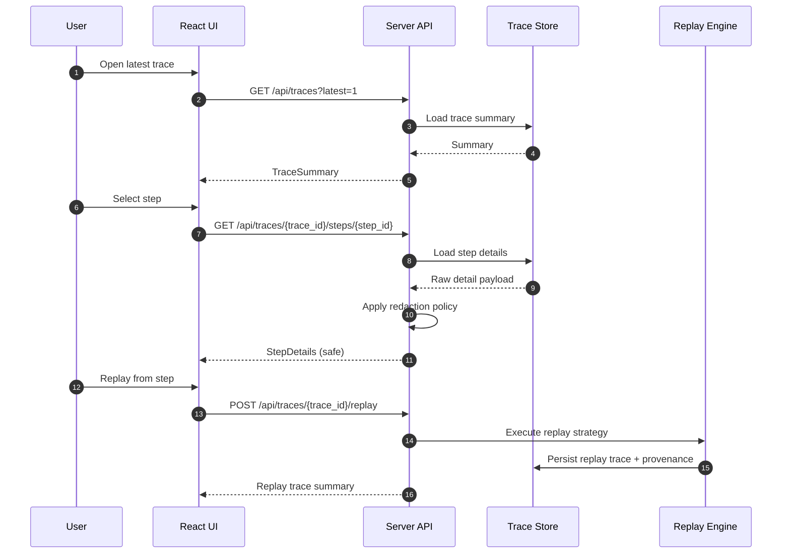
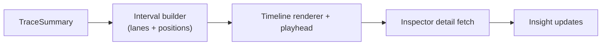
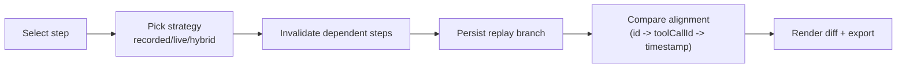
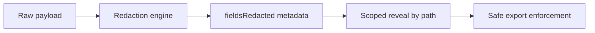

# Architecture

This document explains how Agent Director ingests traces, serves safe data contracts, and powers the cinematic UI experience.

## 1) System Topology

## 2) Data Model (Summary vs Detail)

## 3) Request Flow (Runtime Sequence)

## 4) Playback Pipeline

## 5) Replay + Compare Pipeline

## 6) Safety Pipeline

## 7) Scalability and Reliability Controls

- Windowed rendering for large traces.
- Lazy loading for step details.
- Matrix replay job status model with cancellation support.
- Async action rail and retry queue for long-running operations.
- Deterministic quality gates (`make verify`, `make doctor`, `make scorecard`).

## 8) Primary Source Files

- Server entrypoint: `server/main.py`
- MCP entrypoint: `server/mcp_server.py`
- UI shell: `ui/src/App.tsx`
- Frontend API client: `ui/src/lib/api.ts`

## 9) Related Docs

- Setup and run: [`getting-started.md`](getting-started.md)
- Endpoints: [`api-reference.md`](api-reference.md)
- UX model: [`ux.md`](ux.md)
- Technical overview: [`technical-guide.md`](technical-guide.md)
