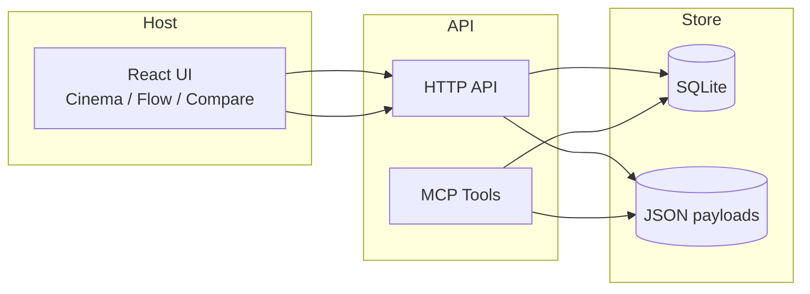
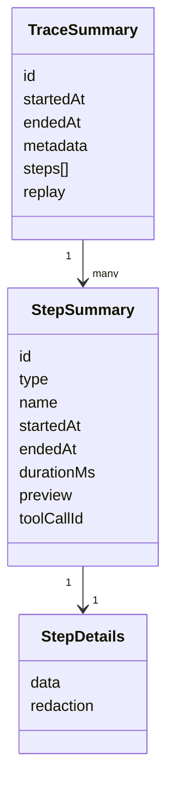
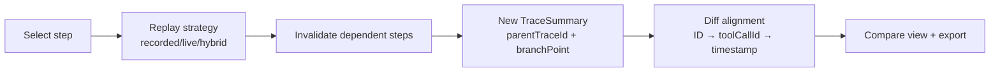
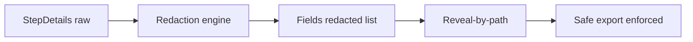

# Architecture

## System overview


## Data model (summary vs details)


## Playback pipeline
```mermaid
flowchart LR
  A[TraceSummary] --> B[buildIntervals\n(lanes + % positions)]
  B --> C[Timeline + playhead]
  C --> D[Inspector fetch\nget_step_details]
```

## Replay + diff pipeline


## Safety pipeline

