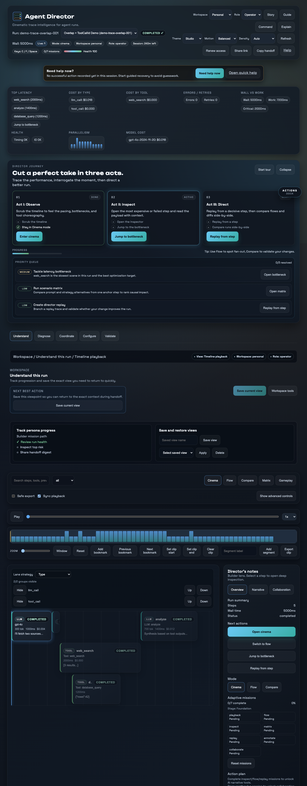
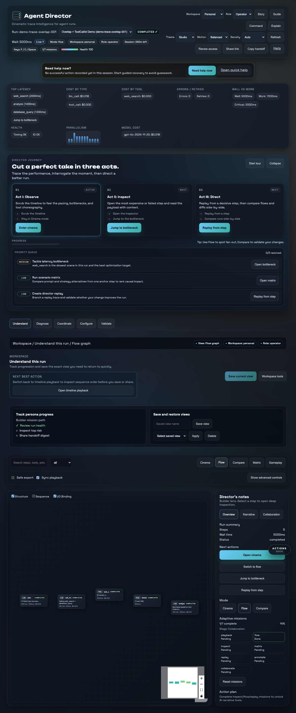
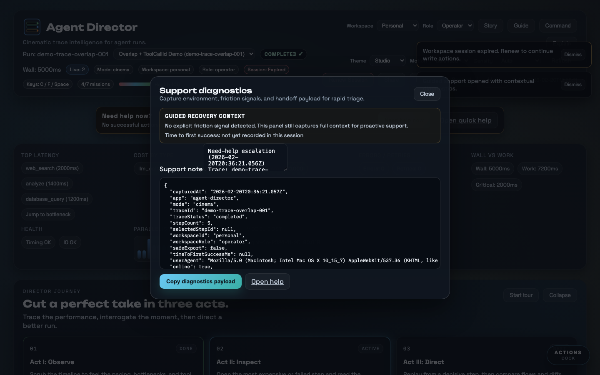
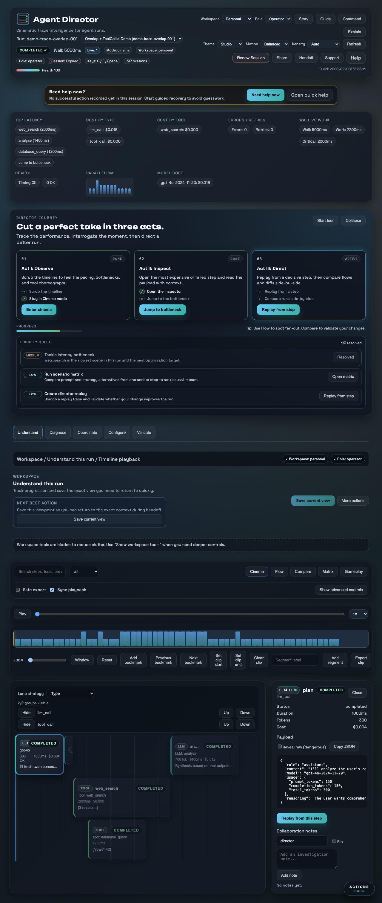
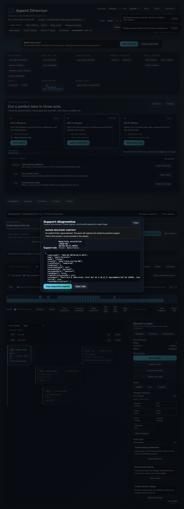

% Agent Director
% Jason Lovell
% January 30, 2026

# Agent Director

**Watch your agent think. Then direct it.**

Cinematic, chat-native trace debugging for AI agents.

---

# The Problem

- Agent runs are multi-step, parallel, and tool-heavy.
- Debugging still relies on logs and dashboards.
- The user experience is detached from chat.

**Result:** high friction, poor observability, slow iteration.

---

# The Insight

If you can **watch** a run unfold, you can **direct** it.

- Faithful time yields immediate intuition.
- Graph semantics reveal structure and dependencies.
- Replay + diff turns traces into experiments.

---

# The Product

---

# The Morph

---

# Director's Cut

---

# The System (Live Product Surface)

---

# Director’s Cut Pipeline (In Product)

---

# Insight Strip (Operational Signals)

---

# Onboarding that lands fast

- Intro overlay frames Observe → Inspect → Direct.
- Director briefing offers Tour, Story, and Explain instantly.
- Guided tour + explain overlays remove guesswork.
- Story mode runs the full demo hands-free.

---

# Why It Wins

- **Truthful time**: real timestamps + overlap lanes.
- **Meaningful graph**: structure, sequence, I/O binding.
- **Safe by default**: redaction-first + safe export.
- **Replay integrity**: deterministic invalidation + diff export.
- **Production ready**: perf gates, tests, CI, and tooling.

---

# Call to Action

Ship the new standard for trace debugging.

Agent Director makes agents *inspectable*, *malleable*, and *explainable* in minutes.
