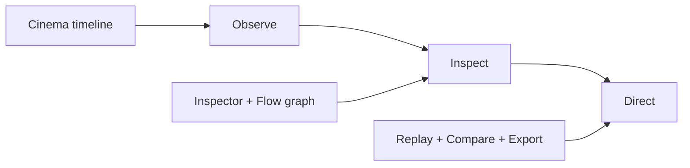

# Story: Agent Director

## The Problem

Modern agent systems are multi-step, concurrent, tool-heavy, and failure-prone. Most teams still debug them with fragmented logs and ad-hoc dashboards. This creates slow diagnosis, weak handoffs, and low confidence in release decisions.

## The Core Insight

If teams can **watch** a run truthfully, they can **direct** it confidently.

Agent Director makes time, causality, and outcomes visible in one place, then gives teams safe mechanisms to replay and compare what changed.

## The Promise

> "Watch your agent think. Then direct it."

## Why Now

- Tool-using agents are now production-critical.
- Teams need run-level explainability, not just endpoint metrics.
- Replay and scenario testing are now required for reliable release decisions.

## Product Principles

1. **Truthful time** — preserve wall-clock behavior and overlap.
2. **Meaningful structure** — show semantic edges, not just order.
3. **Replay integrity** — deterministic replay and explainable diffs.
4. **Safe sharing** — redaction-first and safe-export guardrails.
5. **Instant comprehension** — insight-first surfaces in seconds.

## Story In Three Acts



## The Magic Moments

1. **Cinema Mode**
A truthful timeline makes bottlenecks and parallelism obvious.

2. **The Morph**
Users shift from timeline to flow graph without losing context.

3. **Director's Cut**
Teams replay from a branch point, compare outcomes, and decide with evidence.

## Storyboard (ASCII)

```
[ Load run ] -> [ Cinema playback ] -> [ Inspect step ]
                         |                  |
                         v                  v
                   [ Morph to Flow ]   [ Replay branch ]
                         |                  |
                         v                  v
                     [ Compare ] ------> [ Export + Share ]
```

## Audience Outcomes

- **Engineers:** faster root-cause isolation and replay confidence.
- **Operations/support:** consistent handoffs with shareable artifacts.
- **Product/release leads:** evidence-backed go/no-go decisions.

## Related Docs

- Non-technical guide: [`non-technical-guide.md`](non-technical-guide.md)
- Technical guide: [`technical-guide.md`](technical-guide.md)
- User journeys: [`user-journeys.md`](user-journeys.md)
- Demo script: [`demo-script.md`](demo-script.md)
