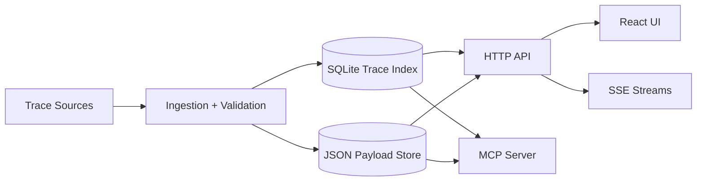

# Technical Guide

This guide is for engineers who need a practical system view of Agent Director.

## System Topology



Primary implementation surfaces:
- Server runtime + HTTP endpoints: `server/main.py`
- MCP entrypoint: `server/mcp_server.py`
- UI app shell and modes: `ui/src/App.tsx`
- Shared frontend API client contracts: `ui/src/lib/api.ts`

## Runtime Contracts

### Trace model
- Trace summaries are list-safe and optimized for timeline rendering.
- Step details are fetched lazily on demand.
- Redaction metadata is included for safe handling and auditability.

### Replay + compare
- Replay branches are anchored to a source step and strategy.
- Invalidation is deterministic relative to dependency boundaries.
- Compare alignment is stable via identifiers and timing fallbacks.

### Matrix jobs
- Batch scenarios execute as replay jobs.
- Matrix summaries include scenario-level output deltas.
- Causal ranking surfaces likely high-impact modifications.

## API Surfaces

Core endpoint families:
- `/api/traces/*` for run querying and replay.
- `/api/replay-jobs/*` for matrix orchestration.
- `/api/gameplay/*` for gameplay/session systems.
- `/api/stream/*` for SSE updates.

Full reference: [`api-reference.md`](api-reference.md)

## Frontend Architecture

Core UX surfaces:
- **Cinema:** playback-first, truthful timeline rendering.
- **Flow:** semantic graph and edge-layer overlays.
- **Compare:** baseline vs replay alignment and diff visualization.
- **Matrix:** N-scenario execution, ranking, and export.

Cross-cutting UI systems:
- Setup/onboarding layer
- Explain mode and guided tour
- Async action rail + export queue
- Ownership/handoff + support diagnostics

Details: [`ux.md`](ux.md), [`visual-system.md`](visual-system.md)

## Local Development

```bash
pnpm -C ui install
python3 server/main.py
pnpm -C ui dev
```

Optional MCP mode:

```bash
pip install "mcp[cli]"
python3 -m server.mcp_server
```

### Important environment variables

Server:
- `AGENT_DIRECTOR_DATA_DIR`
- `AGENT_DIRECTOR_SAFE_EXPORT`
- `AGENT_DIRECTOR_MCP_TRANSPORT`
- `AGENT_DIRECTOR_UI_URL`

UI:
- `VITE_API_BASE`
- `VITE_FORCE_DEMO`
- `VITE_SKIP_INTRO`
- `VITE_HIDE_BUILD_DATE`
- `BASE_PATH`

## Quality Gates

- `make verify` — standard quality gate
- `make verify-strict` — strict + mutation checks
- `make verify-ux` — UX and accessibility checks
- `make doctor` — release evidence artifact
- `make scorecard` — 10/10 domain score validation

## Deployment

Vercel static demo configuration is defined in:
- `vercel.json`
- root `package.json` (`packageManager` pin)

Hosting runbook: [`hosting.md`](hosting.md)

## Suggested Reading Order

1. [`getting-started.md`](getting-started.md)
2. [`architecture.md`](architecture.md)
3. [`api-reference.md`](api-reference.md)
4. [`ux.md`](ux.md)
5. [`ops/release-safety.md`](ops/release-safety.md)
