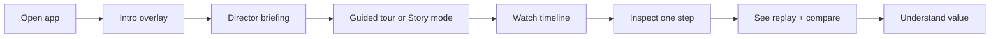
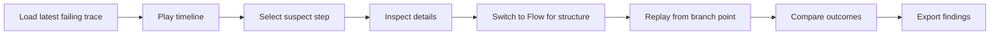
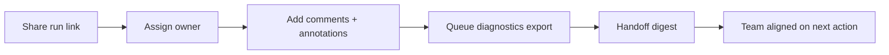
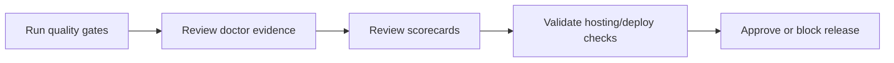

# User Journey Maps

This document defines the primary user journeys required for a release-ready experience.

## Journey Inventory

| Journey | Primary User | Trigger | Success Signal |
|---|---|---|---|
| J1: First-time evaluator | Product/engineering lead | Seeing the product for the first time | Understand value and complete demo path in < 5 minutes |
| J2: Daily operator diagnosis | Engineer/on-call | Investigating a problematic run | Isolate root cause and produce clear handoff summary |
| J3: Team collaboration review | Multi-role response team | Shared incident triage | Coordinate actions with ownership and artifacts |
| J4: Release gate verification | Release owner | Pre-release sign-off | Evidence-backed quality gates and publish confidence |

## Route-Shell Canonical Journeys (v2)

| Route | Primary Persona | Dominant Outcome | Completion Signal |
|---|---|---|---|
| `overview` | Evaluator / lead | Understand health, risk, and next decision quickly | `Review run health` checkpoint captured |
| `triage` | On-call operator | Resolve incident with deterministic sequence | `Observe -> Isolate -> Validate -> Share` completed |
| `diagnose` | Investigator | Produce evidence-backed root cause finding | `Share findings` checkpoint captured |
| `coordinate` | Incident coordinator | Keep ownership and handoff continuity aligned | Snapshot and digest captured with owners set |
| `settings` | Admin/operator | Configure trust defaults and feature controls | Safe-export/trust/cohort settings persisted |

## J1: First-Time Evaluator

Success checkpoints:
- User can explain the Observe -> Inspect -> Direct model.
- User can run one end-to-end walkthrough without assistance.

## J2: Daily Operator Diagnosis

Success checkpoints:
- Root cause candidate identified with evidence.
- Exported summary is suitable for handoff.

## J3: Team Collaboration Review

Success checkpoints:
- Ownership is explicit and visible.
- Team receives consistent context in one artifact chain.

## J4: Release Gate Verification

Success checkpoints:
- Gate status is evidence-backed (not anecdotal).
- Decision to release or hold can be explained quickly.

## Common Failure Paths + Recovery

| Failure pattern | Recovery path |
|---|---|
| User overwhelmed on first view | Guided tour + Story mode + Explain mode |
| Confusion in dense traces | Insight Strip + mode-specific quick actions |
| Long-running action uncertainty | Async action rail with retry/resume states |
| Unsafe sharing risk | Enable Safe export and verify redaction metadata |
| Team context loss | Ownership + handoff digest + diagnostics export |

## Journey Metrics To Track

- Time to first meaningful insight
- Time to incident diagnosis
- Replay-to-compare completion rate
- Export-to-handoff completion rate
- Release gate pass confidence (doctor + scorecard coverage)

## Related Docs

- UX model: [`ux.md`](ux.md)
- Demo script: [`demo-script.md`](demo-script.md)
- Non-technical guide: [`non-technical-guide.md`](non-technical-guide.md)
- Technical guide: [`technical-guide.md`](technical-guide.md)
