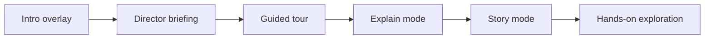

# UX Model

## Modes
- **Cinema** — playback timeline with overlap lanes and inspector.
- **Flow** — semantic graph with edge layers and windowed rendering.
- **Compare** — side-by-side timelines with aligned diff summary.
- **Matrix** — multi-scenario replay outcomes with causal ranking, presets, and safe-share exports.


## Interaction loop
1. Load trace → watch playback.
2. Select a step → inspect details (redacted by default).
3. Switch to Flow → read structure and I/O binding.
4. Replay a step → compare vs base → export diff.
5. Run Matrix scenarios → rank causal factors across outcomes → export matrix artifacts.

## Story mode + command palette
- **Story mode** auto-runs a guided walkthrough for demos and onboarding.
- **Command palette** (Cmd/Ctrl + K) exposes every action, mode, and safety toggle.
- **Quick actions dock** keeps critical controls within reach during live demos (and can collapse to a single button).
- **Explain mode** adds contextual callouts on hover for every major control.

## Onboarding stack
1. **Intro overlay** sets the three-act mental model (Observe → Inspect → Direct) and offers Tour or Story mode.
2. **Director briefing** surfaces Tour, Story, and Explain in one place.
3. **Guided tour** highlights the main controls in order.
4. **Explain mode** offers just-in-time help on any element.
5. **Story mode** runs the full demo hands-free.



## Keyboard shortcuts
- `Space` — Play / pause
- `← / →` — Step boundary back / forward
- `Shift + ← / →` — Jump to start / end
- `F` — Toggle Flow mode
- `I` — Toggle Inspector
- `S` — Story mode
- `E` — Explain mode
- `T` — Start tour
- `Cmd/Ctrl + K` — Command palette
- `?` — Show shortcuts
- `Esc` — Close modal / inspector

## Progressive disclosure
- Step details load only on selection.
- Sensitive payloads are redacted by default.
- Safe export disables raw mode and reveal paths.
- Matrix exports include explicit redaction metadata when safe export is enabled.

## Matrix workflow
1. Select an anchor step and choose presets or custom modifications.
2. Validate each scenario (JSON object, unique name).
3. Run the matrix to populate the summary table and causal ranking.
4. Open scenario details to review modifications and top changed steps.
5. Export the matrix JSON + markdown summary for sharing.

## Safe-share matrix
- Enable **Safe export** in the toolbar.
- Address any sensitive key warnings before running.
- Export the matrix JSON + markdown summary (both include redaction metadata).

## Empty states
- No steps: show onboarding tips and quick actions.
- Large traces: windowed mode defaults on.

## Motion principles
- Morph between Cinema ↔ Flow using FLIP.
- Emphasize status changes via subtle color + glow.
- Reduce motion automatically when user requests.

## Responsive review (automated)
Playwright captures tablet and mobile snapshots to keep layout quality consistent. Generated by `ui/tests/e2e/ux-review.spec.ts`.

### Tablet (900×1100)


### Mobile (414×896)


## Deep review workflow
Use the UX checklist walkthrough with traces + video for a human-in-the-loop pass:

```bash
make verify-ux
```

The walkthrough is defined in `ui/tests/e2e/ux-checklist.spec.ts`.

Artifacts:
- `ui/playwright-report/` — interactive report with step annotations
- `ui/test-results/` — per-test traces, screenshots, and videos
- `ui/.lighthouseci/` — Lighthouse budgets + metrics
