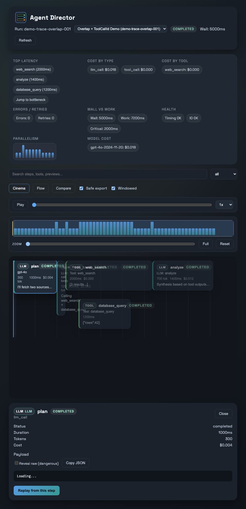
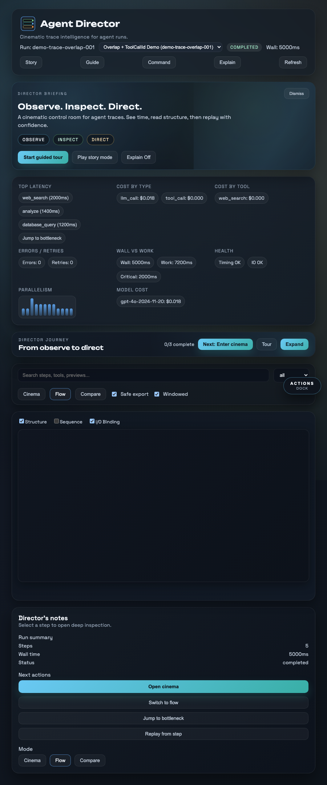
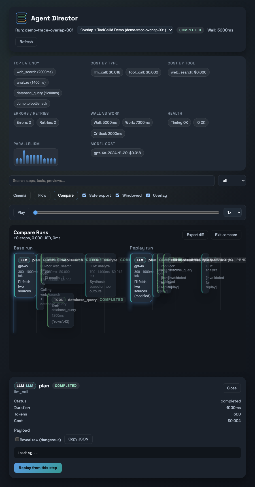
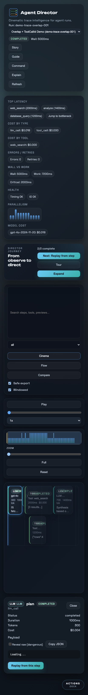
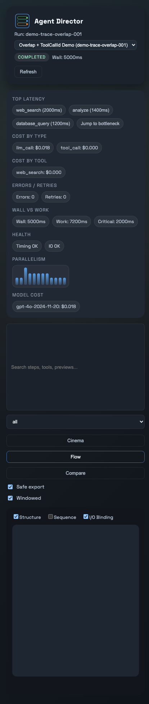
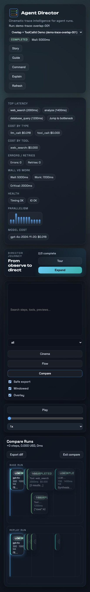

# UX Model

## Modes
- **Cinema** — playback timeline with overlap lanes and inspector.
- **Flow** — semantic graph with edge layers and windowed rendering.
- **Compare** — side-by-side timelines with aligned diff summary.


## Interaction loop
1. Load trace → watch playback.
2. Select a step → inspect details (redacted by default).
3. Switch to Flow → read structure and I/O binding.
4. Replay a step → compare vs base → export diff.

## Keyboard shortcuts
- `Space` — Play / pause
- `← / →` — Step boundary back / forward
- `Shift + ← / →` — Jump to start / end
- `F` — Toggle Flow mode
- `I` — Toggle Inspector
- `?` — Show shortcuts
- `Esc` — Close modal / inspector

## Progressive disclosure
- Step details load only on selection.
- Sensitive payloads are redacted by default.
- Safe export disables raw mode and reveal paths.

## Empty states
- No steps: show onboarding tips and quick actions.
- Large traces: windowed mode defaults on.

## Motion principles
- Morph between Cinema ↔ Flow using FLIP.
- Emphasize status changes via subtle color + glow.
- Reduce motion automatically when user requests.

## Responsive review (automated)
Playwright captures tablet and mobile snapshots to keep layout quality consistent. Generated by `ui/tests/e2e/ux-review.spec.ts`.

### Tablet (900×1100)




### Mobile (414×896)




## Deep review workflow
Use the UX checklist walkthrough with traces + video for a human-in-the-loop pass:

```bash
make verify-ux
```

The walkthrough is defined in `ui/tests/e2e/ux-checklist.spec.ts`.

Artifacts:
- `ui/playwright-report/` — interactive report with step annotations
- `ui/test-results/` — per-test traces, screenshots, and videos
- `ui/.lighthouseci/` — Lighthouse budgets + metrics
